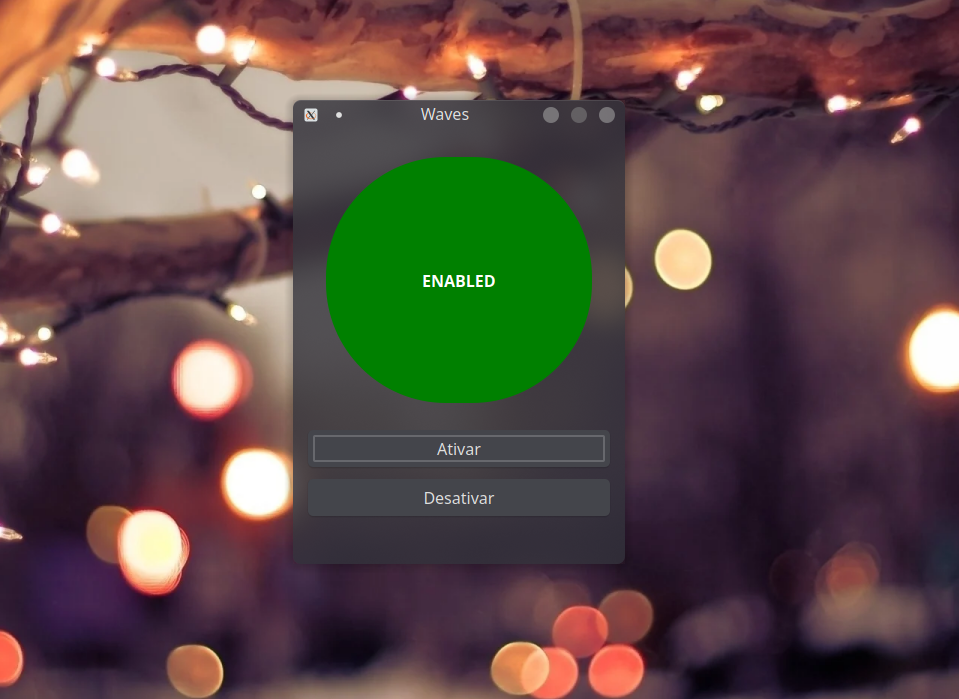

# Waves

> _"Raise your words, not your voice. It is rain that grows flowers, not thunder."_
<br> — Rumi

<!-- img -->
<p>
  
</p>
<!-- Img -->

## Description

Waves is an aid in stuttering therapy, it works by creating an echo of your own voice making your speech linear.

## Requirements

* Plataform Linux
* Installed pulse-audio
* Qt5

## Build

To build, follow the instructions below.

```$ qmake waves.pro```

```$ make```
